# AutoDRIVE RoboRacer Racetracks
1/10 Scale 3D Race Tracks for AutoDRIVE Simulator

## Custom Racetracks

> [!TIP]
> Steps 1-3 assume that you are trying to reconstruct a physical RoboRacer racetrack based on its occupancy grid map (e.g., using SLAM). Skip to step 4 if you are designing a novel racetrack.

**Step 1:** Convert the occupancy grid map of the real-world track to `PNG` using a third-party graphics editing tool like [Adobe Photoshop](https://www.adobe.com/products/photoshop.html) (free and open-source alternative: [Inkscape](https://inkscape.org)).

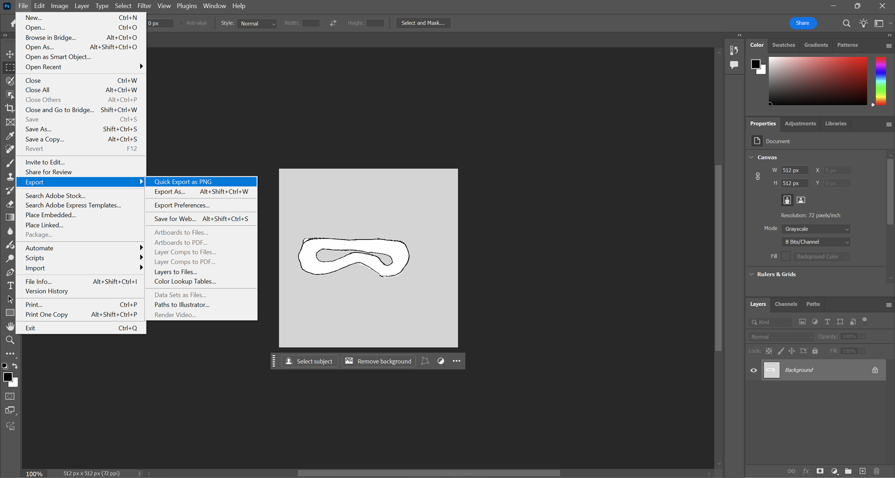

**Step 2:** Import the `PNG` image of the occupancy grid map into a third-party 3D modeling tool like [Trimble SketchUp](https://sketchup.trimble.com) (free and open-source alternative: [Blender](https://www.blender.org)).

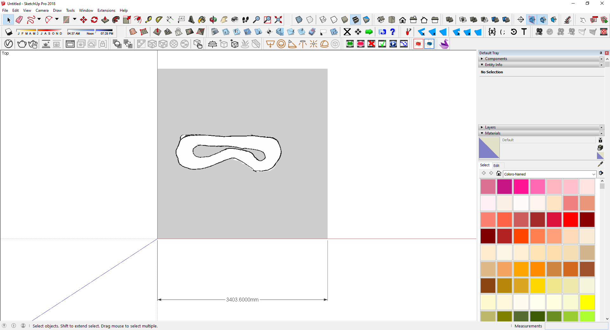

**Step 3:** Scale the `PNG` image of the occupancy grid map based on the `resolution` field specified in the `YAML` file accompanying the occupancy grid map.

$S_{\text{cartesian}} = R_{\text{map}} \cdot S_{\text{map}}$

- $S_{\text{cartesian}}$ = Cartesian size (in meters)
- $R_{\text{map}}$ = Map resolution
- $S_{\text{map}}$ = Map size (in pixels)

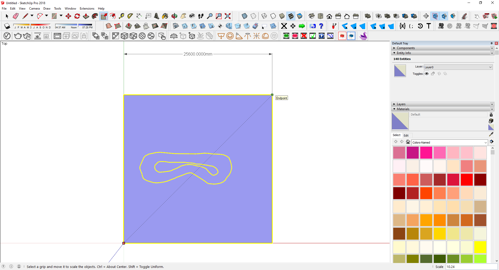

**Step 4:** Use a freehand tool to trace the inner and outer bounds of the racetrack based on the scaled `PNG` image of the occupancy grid map. Alternatively, design the outlines of your novel racetrack.

| 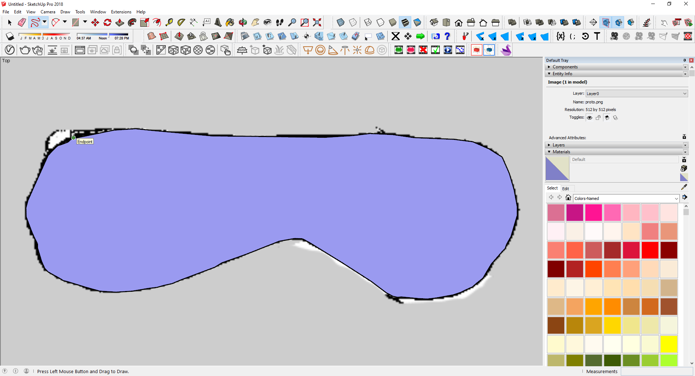 |  |
|:-------------------------:|:--------------------------|

**Step 5:** If required, soften and explode the freehand curves for finer control.

|  | 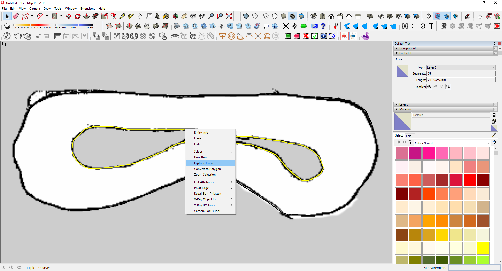 |
|:-------------------------:|:--------------------------|

**Step 6:** If required, correct any minor flaws or discontinuities in the track bounds.

| 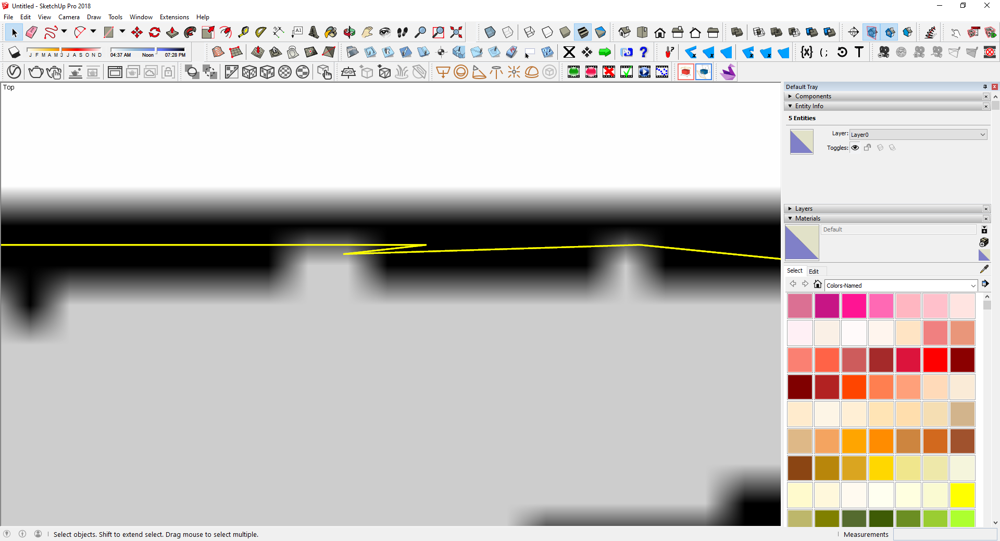 | 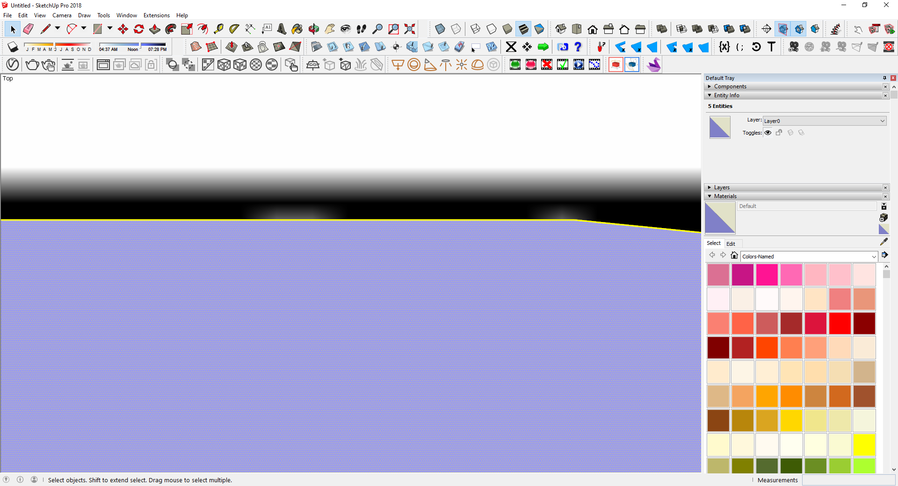 |
|:-------------------------:|:--------------------------|

**Step 7:** You now have the track bounds ready for 3D modeling.

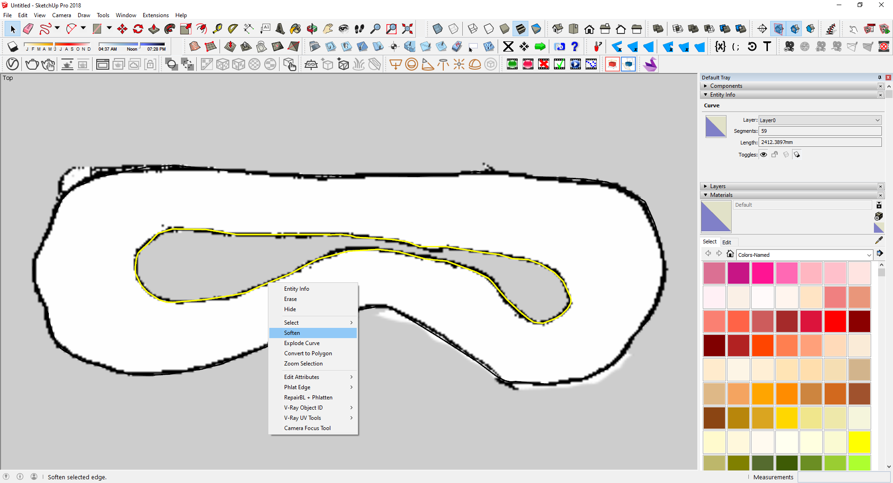

**Step 8:** Create a circular cross-section to be swept across the track bounds, thereby representing the hollow air ducts. The radius of this cross-section will depend on the radius of the air ducts.

- [Legacy Tracks](Legacy%20Tracks) follow 5 in (127 mm) air ducts.
- [Sim Racing Tracks](Sim%20Racing%20Tracks) use 6 in (152.4 mm) air ducts.

**Step 9:** If required, group the cross-section entity to ensure that it can be translated/rotated/scaled without affecting any other geometry in the scene.

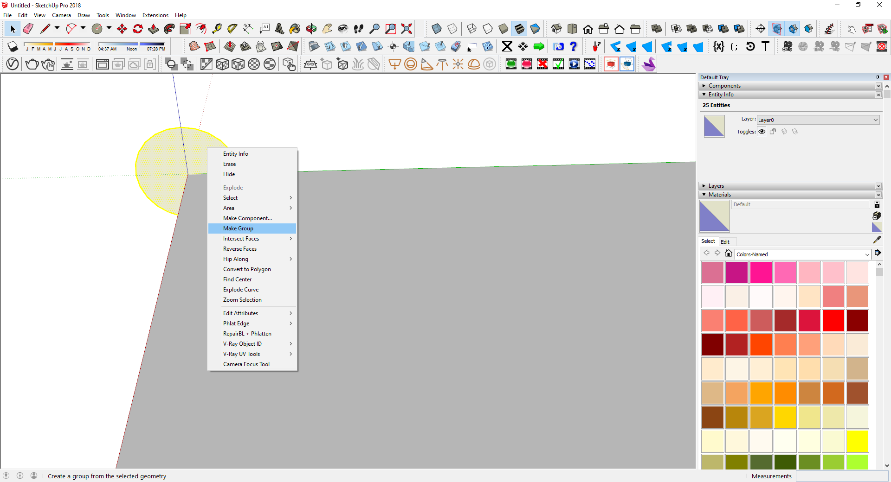

**Step 10:** Move the cross-section entity such that the center of the circle coincides with the track bound. Duplicate the cross-section entity and repeat this for every discontinuous portion of the racetrack.

| 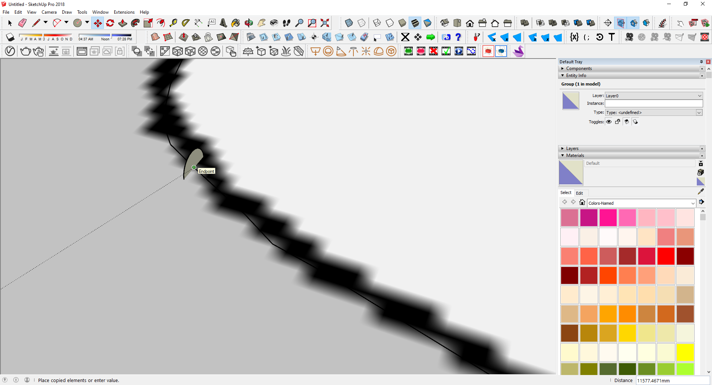 |  |
|:--------------------------:|:---------------------------|

**Step 11:** Rotate the cross-section entity such that it aligns perpendicular to the tangent at that point on the track bound. Repeat this for all the cross-section entities.

|  |  |
|:--------------------------:|:---------------------------|

**Step 12:** If required, ungroup (a.k.a. explode) the cross-section entity to enable further operations.

**Step 13:** If required, sub-divide the edge of each circular cross-section (e.g., 100 segments) to ensure a smooth hull for the air ducts.

|  |  |
|:--------------------------:|:---------------------------|

**Step 14:** Sweep (a.k.a. follow me) the circular cross-sections along the track bounds to create the 3D geometry.

|  | 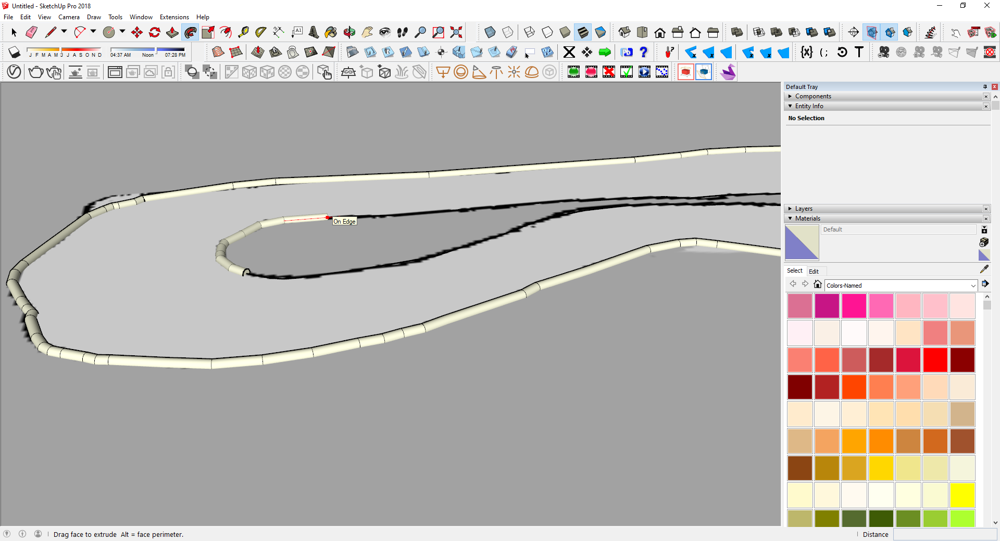 |
|:--------------------------:|:---------------------------|

**Step 15:** Add 2 separate materials to the inner and outer surfaces of the 3D air ducts.

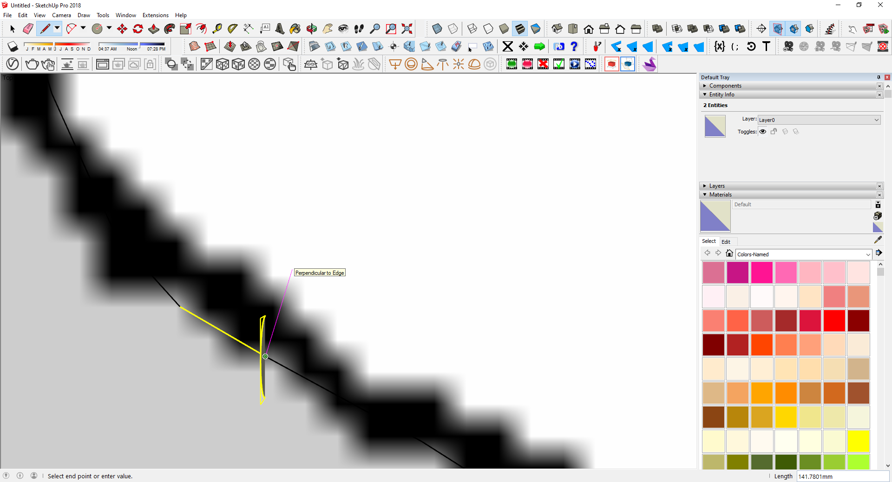

**Step 16:** The 3D racetrack is now ready to be imported within AutoDRIVE Simulator. Refer [this](https://docs.unity3d.com/2022.3/Documentation/Manual/3D-formats.html) documentation to learn more about the supported import formats.

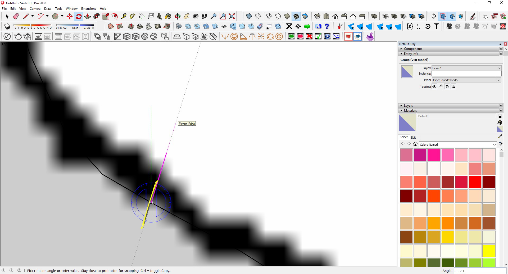

**Step 17:** Upon importing in AutoDRIVE Simulator, update the materials in the `Mesh Renderer` component to improve photorealism, and add a `Mesh Collider` component to enable collision detection and resolution.

| 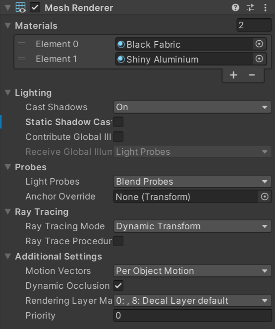 | 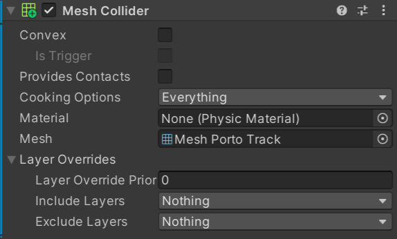 |
|:--------------------------:|:---------------------------|